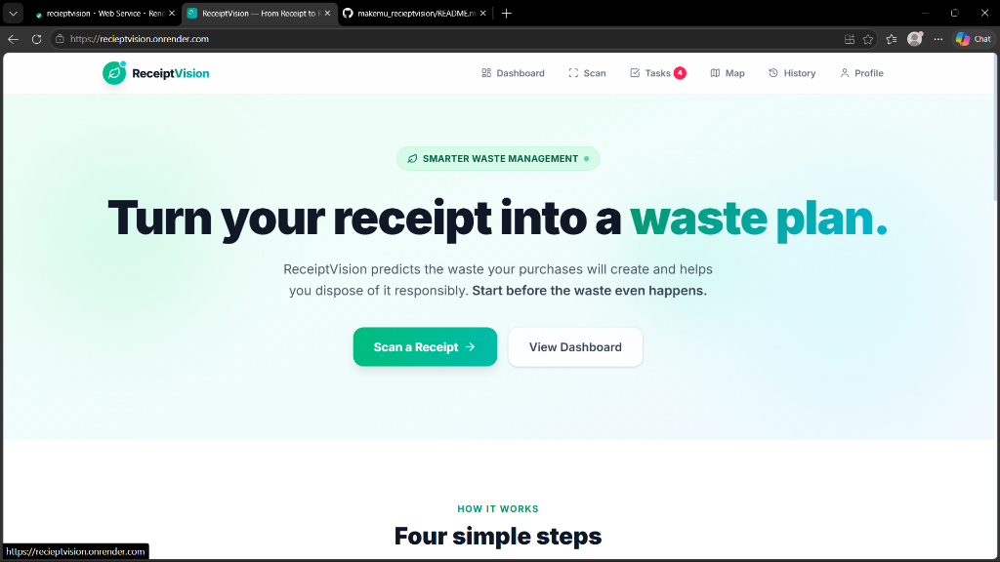
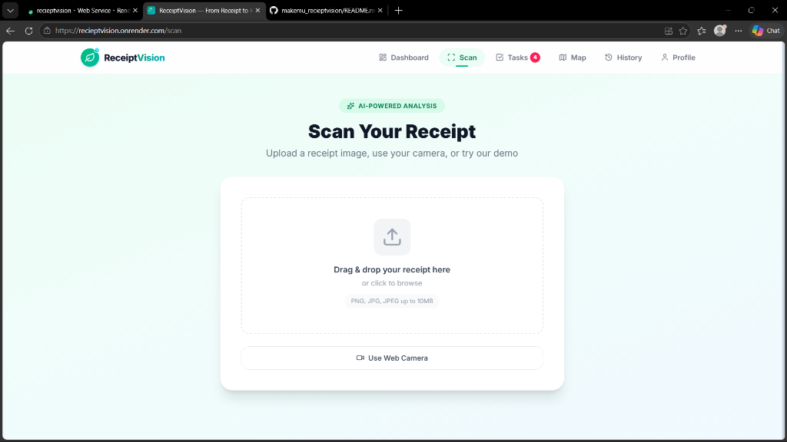
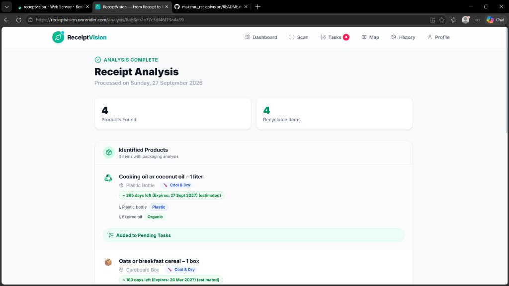
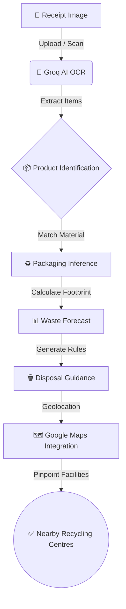

# ReceiptVision 🎯

## Basic Details
### Team Name: CodeX

### Team Members
- Team Lead: Adithyan V S - GECI
- Member 2: Adhnan Mundampra - GECI

### Project Description
An AI-powered predictive waste management platform that scans grocery receipts, predicts the waste your purchases will generate, and helps you dispose of it responsibly.

### The Problem 
People often buy groceries without realizing the amount and type of waste the packaging will generate. This leads to improper disposal, contamination of recyclables, and increased landfill waste because consumers lack accessible knowledge on how to recycle specific items or where to drop off special waste.

### The Solution 
ReceiptVision solves this by using AI to scan grocery receipts, instantly identifying purchased products, inferring their packaging materials, and forecasting the resulting waste footprint. It provides a visual breakdown of your waste, step-by-step disposal guidelines for each material, and uses geolocation/Google Maps to pinpoint the nearest appropriate recycling centers. 

## Technical Details
### Technologies/Components Used
For Software:
- **Languages used**: JavaScript, HTML, CSS
- **Frameworks used**: React, Express.js, Tailwind CSS
- **Libraries used**: Vite, Mongoose, Recharts, Lucide React, Axios, React Leaflet, Multer, Groq SDK
- **Tools used**: MongoDB Atlas, Google Maps API, Groq Cloud (Llama 4 Scout / Qwen 2.5 VL), Render (Hosting)

For Hardware:
- *Not Applicable*

### Implementation
For Software:
# Installation
```bash
# Install dependencies for both client and server
npm run install-all

# Configure environment variables
cp .env.example .env
```
*(Edit the `.env` file to add your MongoDB URI, Groq API Key, and Google Maps API Key)*

# Run
```bash
# Run both frontend and backend concurrently
npm run dev

# (Alternatively, for production on Render)
npm run build
npm start
```

### Project Documentation
For Software:

# Screenshots (Add at least 3)

*Landing page and Receipt Scanner interface*


*Receipt scanning and upload interface*


*Waste Forecast and packaging breakdown analytics*

# Diagrams


*Architecture Pipeline: From receipt scanning to responsible disposal.*

For Hardware:
*Not Applicable*

### Project Demo
# Video
[Watch Demo Video](./docs/recording.webm)
*This video demonstrates scanning a sample grocery receipt, viewing the generated waste forecast, exploring disposal guidelines, and finding nearby recycling facilities on the map.*

# Additional Demos
[Live Demo: https://receiptvision.onrender.com](https://receiptvision.onrender.com)

## Team Contributions
- **Team Lead (Adithyan V S)**: Project Management, UI/UX Design, Ideation, Presentation Preparation, Demo Video Creation, and Project Documentation.
- **Member 2 (Adhnan Mundampra)**: Core Full-Stack Development (React & Express), Groq AI OCR Integration, Google Maps API Setup, Database Configuration, and Application Deployment.

---
Made with ❤️ at MuLearn MakeMu
